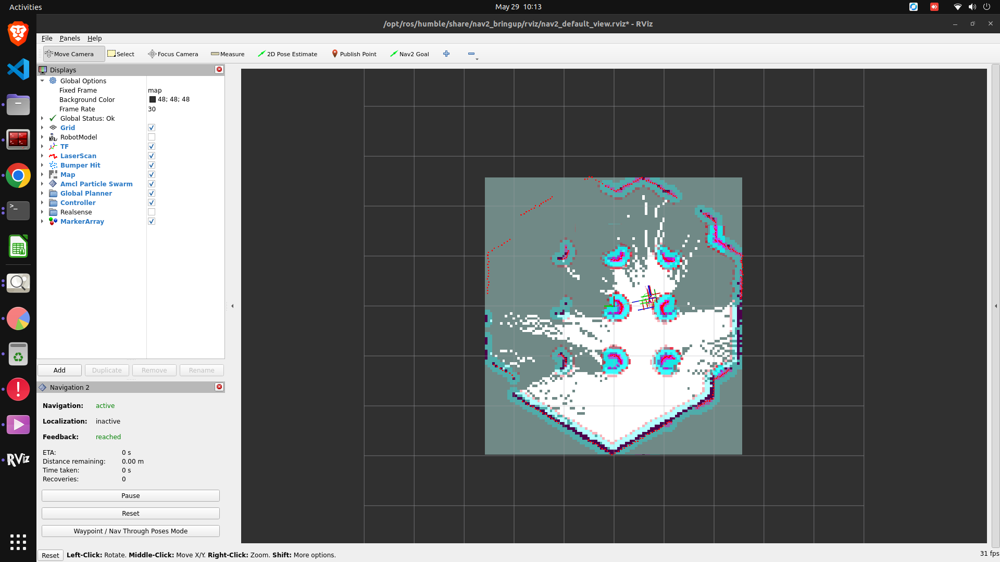
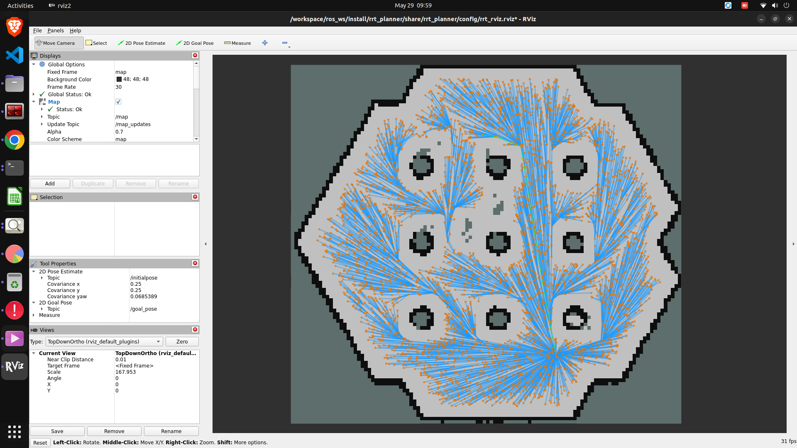

# TurtleBot3 Semantic Autonomy Stack

> ROS2 Humble · Gazebo 11 · Isaac Sim 4.5 · macOS Apple Silicon · Docker

Complete simulation stack for autonomous exploration, SLAM, custom RRT* planning, and semantic navigation on TurtleBot3 Burger.

**Docker image:** `nehalnevle/turtlebot3-autonomy:humble`

---

## Implementation Status

| Section | Status |
|---|---|
| **Section 1 — Exploration & SLAM** (slam_toolbox + explore_lite, RViz, saved map) | ✅ Complete |
| **Section 2 — Semantic Reasoning** (Grounding-DINO + CLIP + NetworkX graph + Nav2 query) | ✅ Implemented — not fully end-to-end tested |
| **Section 3 — Custom RRT\* Planner** (C++ Nav2 plugin, RViz MarkerArray, live robot following) | ✅ Complete |
| **Bonus — Isaac Sim 4.5** (RTX LiDAR, SLAM, Nav2 in Isaac Sim via Docker) | ✅ Complete |

> **Note on Section 2:** The semantic pipeline (perception → graph → query → Nav2 goal) is fully implemented — all nodes build and launch. However, it has not been fully tested end-to-end in simulation with a live exploration run. The architecture, ROS2 interfaces, and inference logic are complete; integration testing under full autonomy loop is pending.

---

## Screenshots

**SLAM map building in RViz (Section 1)**


**RRT\* planner tree visualized in RViz (Section 3)**


---

## Videos

| Recording | Description |
|---|---|
| [`demo_exploration.webm`](assets/demo_exploration.webm) | Autonomous exploration + SLAM in Gazebo |
| [`screen_recording_may29.mov`](assets/screen_recording_may29.mov) | RRT\* planner visualization + robot navigation |

---

## Architecture

```
macOS (Apple Silicon)
└── Docker (Ubuntu 22.04 ARM64)
    └── ROS2 Humble
        ├── turtlebot3_gazebo  ──── Simulation + LiDAR + Camera
        ├── slam_toolbox       ──── Online sync SLAM
        ├── explore_lite       ──── Frontier-based exploration
        ├── nav2_bringup       ──── Navigation stack
        ├── rrt_planner        ──── Custom RRT* global planner (C++)
        ├── semantic_perception──── Grounding-DINO + CLIP (sparse)
        ├── semantic_graph     ──── NetworkX semantic memory
        ├── semantic_navigation──── Text query → Nav2 goal
        └── semantic_viz       ──── RViz MarkerArray overlays
```

---

## Prerequisites

### 1. macOS Setup (run once)

```bash
chmod +x scripts/setup_mac.sh
./scripts/setup_mac.sh
```

What it does:
- Installs Homebrew, XQuartz, Docker Desktop
- Configures XQuartz for network connections (needed for GUI forwarding)

After install, **log out and log back in**, then:

```bash
# Open XQuartz
open -a XQuartz

# In XQuartz → Preferences → Security → check "Allow connections from network clients"

# Allow localhost
xhost +localhost

# Add to ~/.zshrc:
export DISPLAY=:0
```

### 2. Docker Desktop Settings

Open Docker Desktop → Settings:
- **Resources → Memory**: 8 GB minimum (12 GB recommended)
- **Resources → CPUs**: 4+
- **General**: Enable "Use Rosetta for x86/amd64 emulation" (optional fallback)

---

## Quick Start (VNC — recommended)

Pull the pre-built image (no build needed):

```bash
# 1. Pull image
docker pull nehalnevle/turtlebot3-autonomy:humble

# 2. Start container
docker compose -f docker/docker-compose.yml up -d

# 3. Launch full stack inside container
docker exec -it tb3_sim /ros2_ws/scripts/start_vnc.sh
```

Then connect a VNC viewer to **`localhost:5900`** (no password). You'll see RViz2 with the robot autonomously mapping the office.

### Alternative: Build from source (~15-20 min)

```bash
cd docker && docker compose build
docker compose run --rm ros2
bash /ros2_ws/scripts/build_workspace.sh
bash /ros2_ws/scripts/start_vnc.sh
```

---

## Step-by-Step Launch

Each step in a separate terminal tab (`docker exec -it tb3_autonomy bash`):

### Step 1 — Simulation

```bash
source /ros2_ws/install/setup.bash
ros2 launch turtlebot3_sim sim.launch.py
```

Verify:
```bash
ros2 topic list | grep -E 'scan|odom|camera'
ros2 run tf2_tools view_frames
```

### Step 2 — SLAM + Autonomous Exploration

```bash
ros2 launch slam_exploration slam_explore.launch.py
```

The robot will autonomously explore and build a map. Save the map:
```bash
ros2 run nav2_map_server map_saver_cli -f /ros2_ws/maps/office_map
```

### Step 3 — RViz

```bash
ros2 launch turtlebot3_sim rviz.launch.py
```

### Step 4 — Semantic Stack

```bash
# Perception (Grounding-DINO + CLIP — loads ~30s first time)
ros2 launch semantic_perception perception.launch.py

# Semantic graph server
ros2 launch semantic_graph graph_server.launch.py

# Semantic navigation query node
ros2 launch semantic_navigation semantic_nav.launch.py

# RViz markers
ros2 launch semantic_viz viz.launch.py
```

### Step 5 — Send a Semantic Navigation Command

```bash
ros2 service call /navigate_semantic semantic_msgs/srv/SemanticQuery \
  "{query_text: 'Go to the kitchen'}"

ros2 service call /navigate_semantic semantic_msgs/srv/SemanticQuery \
  "{query_text: 'Navigate to the pantry'}"

ros2 service call /navigate_semantic semantic_msgs/srv/SemanticQuery \
  "{query_text: 'Where is the meeting room?'}"
```

---

## Teleop (manual control)

```bash
ros2 run teleop_twist_keyboard teleop_twist_keyboard
```

---

## Custom RRT Planner

The RRT* planner is registered as a Nav2 `GlobalPlanner` plugin. It activates automatically when Nav2 uses the `GridBased` planner (configured in `configs/nav2_params.yaml`).

To see the RRT tree in RViz: add **MarkerArray** display → topic `/rrt_tree`.

Parameters (editable in `configs/nav2_params.yaml`):
| Parameter | Default | Description |
|---|---|---|
| `max_iterations` | 5000 | Max RRT iterations per plan |
| `step_size` | 0.1 m | Tree expansion step |
| `goal_tolerance` | 0.2 m | Distance to declare goal reached |
| `goal_bias` | 0.05 | Probability of sampling goal directly |
| `enable_rrt_star` | true | Enable rewiring (RRT* vs RRT) |
| `rewire_radius` | 0.5 m | Rewire neighborhood radius |

---

## Semantic Navigation Details

### System Design

The goal is to give the robot human-like memory: as it explores, it builds a spatial-semantic map it can later query in natural language ("Go to the kitchen"). No hardcoded label→room mappings — all retrieval is embedding-based.

```
Camera frame (sparse: every 1.5m or 30s)
         │
         ▼
  ┌──────────────────┐
  │  Grounding-DINO  │  Open-vocabulary object detection
  │  (base, HF)      │  Input: image + dot-separated text vocab
  └────────┬─────────┘  Output: {label, score, bbox} per object
           │
           ▼
  ┌──────────────────┐
  │  SAM (vit_h)     │  Instance segmentation (optional)
  │                  │  Input: image + bboxes
  └────────┬─────────┘  Output: per-object crops + masks
           │
           ▼
  ┌──────────────────┐
  │  CLIP ViT-B/32   │  Dual use:
  │                  │  (a) embed each crop → (512,) image vector
  │                  │  (b) zero-shot scene classification → room label
  └────────┬─────────┘
           │
           ▼
  ┌──────────────────────────────────────┐
  │  SemanticGraph (NetworkX)            │
  │  Node = {position (3D), clip_emb,    │
  │           scene_type, blip_caption,  │
  │           score, observations}       │
  │  Edges:                              │
  │   - spatial  : dist < 5.0 m         │
  │   - semantic : cosine sim > 0.75    │
  └────────┬─────────────────────────────┘
           │
           ▼
  ┌──────────────────┐
  │  Query at runtime│  Text query → CLIP text embedding
  │                  │  → cosine sim vs all node image embeddings
  │                  │  + BLIP caption word-overlap bonus (+0.05/word)
  │                  │  + scene-type word match bonus (+0.08)
  │                  │  → top-1 node position → Nav2 PoseStamped goal
  └──────────────────┘
```

### Models

| Model | Role | Notes |
|---|---|---|
| **Grounding-DINO-base** (`IDEA-Research/grounding-dino-base`) | Zero-shot object detection | Threshold 0.35; falls back to CPU if no CUDA; input vocab is dot-separated, e.g. `"chair . table . sink ."` |
| **SAM vit_h** | Instance segmentation → crops | Optional — pipeline continues without it; degrades to bbox crops |
| **CLIP ViT-B/32** | (a) image embeddings, (b) scene classification | Dual use; falls back to `openai/clip-vit-base-patch32` via `transformers` if `clip` package unavailable |
| **BLIP-2** (optional) | Image captioning → text caption per node | Used as a word-overlap bonus signal during query scoring, not primary |

### Query Scoring Formula

```
score = clip_cosine(text_query, node_image_emb)
      + 0.05 × min(caption_word_overlap, 3)   # BLIP bonus
      + 0.08                                   # if any query word ∈ scene_type
```

Result returned only if `score ≥ 0.20` (configurable `min_sim`).

### Duplicate Merging

Nodes that are both `< 1.5 m` apart **and** have cosine similarity `> 0.88` are merged: positions are averaged weighted by observation count, the better caption is kept.

### Drawbacks and Edge Cases

**Grounding-DINO**
- Detection quality depends heavily on the text vocabulary passed at inference time. Objects outside the vocab are silently missed. The current vocab is a fixed list — a more robust approach would use a dynamic list derived from the room type being explored.
- Inference is 4–8 s on M2 CPU (model runs every 1.5 m of travel or 30 s, so this rarely blocks navigation, but first-inference latency is ~20 s for model load).
- Confidence threshold (0.35) is a single global value — fine-grained objects (e.g. small items on a shelf) are frequently missed; wide, textureless objects (walls, floors) can produce spurious detections.

**SAM**
- `vit_h` is the largest SAM variant — slow on CPU and requires ~6 GB RAM. If unavailable, the pipeline falls back to bbox crops, which reduces crop quality and therefore CLIP embedding accuracy.
- SAM is used here for crop quality, not for 3D reconstruction — its masks are not used to estimate object volume or distance directly.

**CLIP ViT-B/32**
- ViT-B/32 is a relatively small CLIP model. Embeddings for visually similar rooms (e.g. kitchen vs. pantry, both containing shelves and counters) can have high cosine similarity, making disambiguation difficult.
- Scene classification is zero-shot softmax over a fixed label set — it always picks *something*, even if confidence is low. A hallway glimpsed through a doorway can be mislabelled as the room behind it.
- Text↔image cosine similarity is not calibrated to navigation relevance. A query like "Where I left my coffee" will return a result but the match will be meaningless.
- No temporal consistency: each frame is processed independently, so the same object seen from two angles creates two separate nodes unless the duplicate-merge thresholds catch them.

**Semantic Graph**
- Query is O(N) linear scan — no spatial index. Acceptable for small maps (< 1000 nodes) but degrades on longer exploration runs.
- Duplicate merging requires both spatial proximity **and** visual similarity. If the robot revisits a location from a very different angle, appearance changes enough that cosine < 0.88 and duplicates accumulate.
- The `min_sim = 0.20` rejection threshold is low by design (avoids empty results on ambiguous queries), but it means weak matches can still trigger navigation to wrong locations.
- Graph is serialized as a Python `pickle` file — not portable across Python/library versions.

**3D Position Estimation**
- World position is estimated via BEV projection from camera + nearest-timestamp LiDAR point cloud. If LiDAR and camera publish at different rates, the nearest-timestamp matching can pair a frame with a stale point cloud (e.g. robot has moved 0.5 m between scans).
- No depth model — position accuracy depends entirely on LiDAR coverage of the object's location. Objects above the LiDAR scan plane (e.g. wall-mounted signs) get the robot's current position as a fallback, not the object's true 3D location.

---

## Isaac Sim Setup (Bonus)

A parallel simulation setup using **NVIDIA Isaac Sim 4.5** is provided in `isaac_sim/`. It publishes the same ROS2 topics as Gazebo (`/scan`, `/odom`, `/camera/image_raw`, `/tf`) so the entire nav stack runs unchanged.

See [`isaac_sim/ISAAC_SIM_SETUP.md`](isaac_sim/ISAAC_SIM_SETUP.md) for full instructions.

Quick start:
```bash
# 1. Run Isaac Sim with the TurtleBot3 scene
isaacsim --exec isaac_sim/turtlebot3_ros2_sim.py

# 2. In Docker: launch SLAM + Nav2
docker exec m_explore_ros2 bash /workspace/isaac_sim/launch_slam_astar.sh
```

---

## Gazebo World

`office_semantic.world` contains four zones:
| Zone | Landmarks |
|---|---|
| Kitchen (top-left) | microwave, sink, refrigerator, tables |
| Pantry (top-right) | shelves, storage boxes |
| Meeting room (bottom-left) | round table, 4 chairs, whiteboard |
| Hallway | trash can, plant, sofa |

---

## Troubleshooting

### VNC black screen
```bash
docker exec tb3_sim ps aux | grep Xvfb   # confirm Xvfb is running
```
Reconnect VNC — server stays up, client reconnect always works.

### Robot not moving / "All frontiers traversed" immediately
The global costmap starts small (126×80 cells) and takes ~30s to grow. `start_vnc.sh` waits automatically. If it still happens, check:
```bash
docker exec tb3_sim bash -c "source /opt/ros/humble/setup.bash && ros2 topic echo /global_costmap/costmap --once 2>/dev/null | grep width"
# Should be ≥200 before explore_lite starts
```

### SLAM map frozen
```bash
docker exec tb3_sim bash -c "source /opt/ros/humble/setup.bash && ros2 topic hz /scan"
# Should show ~5 Hz
docker exec tb3_sim cat /tmp/slam.log
```

### Nav2 "Planner failed" repeatedly
Frontier landed inside inflated obstacle zone. Current config (tolerance: 2.0, inflation_radius: 0.15) handles most cases. If persists, reduce `min_frontier_size` in `src/m-explore-ros2/explore/config/params.yaml`.

### Container OOM (exit code 137)
Increase Docker Desktop memory to 10 GB+. Do NOT run gzclient — it's excluded from `start_vnc.sh` intentionally.

### Nav2 not activating
```bash
docker exec tb3_sim cat /tmp/nav2.log | grep -E 'active|error|fail'
```
`transform_timeout` warnings during startup are normal — wait 30s after Nav2 starts.

### Grounding-DINO slow on first inference
Expected. Model loads ~10-20s. Subsequent inferences: 3-8s on M2 CPU. Inference runs sparsely (every 1.5m or 30s).

---

## Performance Expectations (Apple Silicon)

| Component | M1 | M2 | M3 |
|---|---|---|---|
| Gazebo FPS | 10-15 | 15-25 | 20-30 |
| SLAM update rate | 1 Hz | 2 Hz | 2 Hz |
| Grounding-DINO inference | 8-12s | 4-8s | 3-6s |
| CLIP inference | 1-2s | 0.5-1s | 0.3-0.8s |
| Nav2 planning (RRT*) | <1s | <0.5s | <0.3s |

---

## Project Structure

```
turtlebot3-autonomy/
├── assets/             # Screenshots and demo videos
├── docker/             # Dockerfile + docker-compose.yml
├── isaac_sim/          # Isaac Sim 4.5 script + Nav2 config + setup guide
├── scripts/            # setup_mac.sh, build_workspace.sh, launch_demo.sh
├── .devcontainer/      # VSCode Dev Container config
├── configs/            # nav2_params.yaml, slam_toolbox_params.yaml, rviz/
├── maps/               # saved maps and semantic_graph.json (auto-generated)
└── src/
    ├── turtlebot3_sim/         # Gazebo world + launch wrappers
    ├── slam_exploration/       # slam_toolbox + explore_lite launch
    ├── rrt_planner/            # Custom C++ Nav2 RRT* plugin
    ├── semantic_msgs/          # Custom message/service definitions
    ├── semantic_perception/    # Grounding-DINO + CLIP + room inference
    ├── semantic_graph/         # NetworkX graph DB + ROS2 service
    ├── semantic_navigation/    # Query node + Nav2 client
    └── semantic_viz/           # RViz MarkerArray publisher
```
